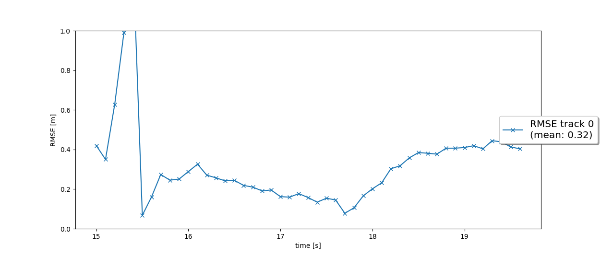
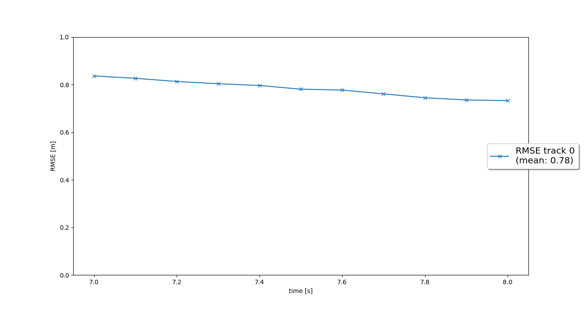
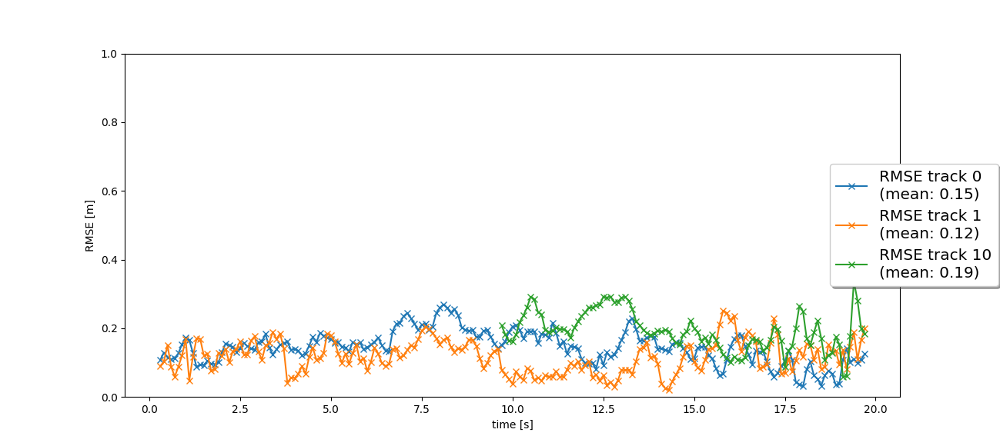
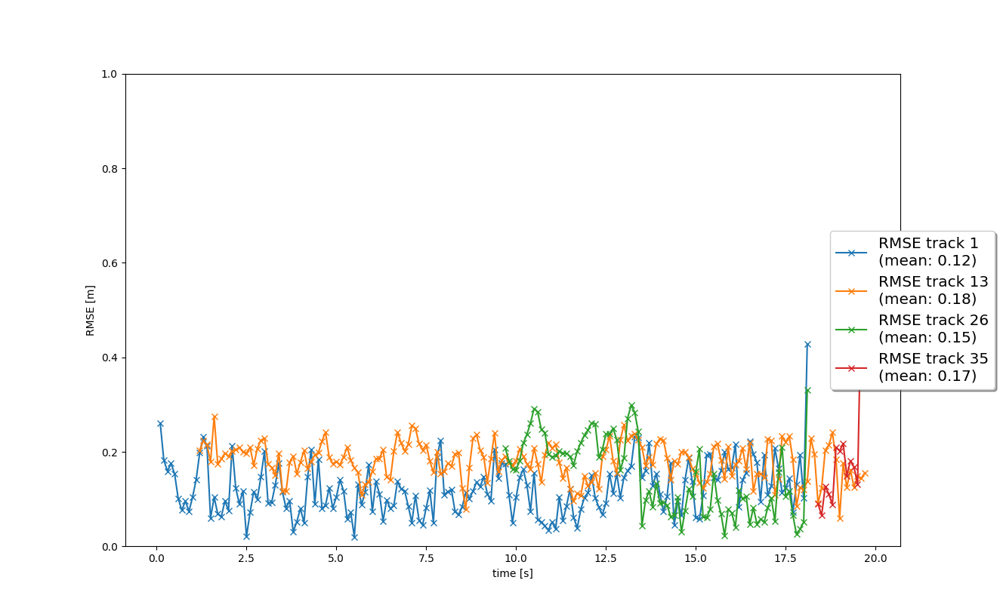

# Writeup: Track 3D-Objects Over Time

Please use this starter template to answer the following questions:

### 1. Write a short recap of the four tracking steps and what you implemented there (filter, track management, association, camera fusion). Which results did you achieve? Which part of the project was most difficult for you to complete, and why?

#### Step 1
In Step 1, I implemented the basic `predict()` and `update()` methods of the Extended Kalman Filter,
including the system matrix, process noise covariance, residual and residual covariance. So far, the
EKF only processes the 3D lidar detections. I tested the filter with a simple sequence in which only
one vehicle is seen. The EKF correctly tracked the vehicle and resulted in a low mean RMSE of 0.32.
Due to the hardcoded initialization parameters, there is a large peak in the RMSE at the beginning
before it stabilizes after a couple of frames.

#### Step 2

In Step 2, I implemented track management functions to be able to initialize and delete tracks when
vehicles appear and disappear from the lidar field of view. The track score is updated at each frame
and the track states set to "initialized", "tentative", or "confirmed" according to the score. In the
test sequence an object enters and later exits the field of view, and it is tracked until the
prediction uncertainty becomes too large after it has left the field of view.

I noticed that the track score is not being decreased in this case after the object has left the FOV.
This is because in the given implementation, the visibility of the object can only be checked if there
is at least one detection in the current frame. In this case, there are no other detections after the
object has left the frame, so the code skips this step.

After implementing all four steps, I changed the implementation here so that the track score can even be
decreased even if there are no remaining detections (commit 7e1608a).

### Step 3

In Step 3, I added simple nearest neighbor association to match measurements to the existing tracks and
thus allow for tracking multiple targets simultaneously. The Mahalanobis distance is calculated for
each pair of track and measurement and inserted into the association matrix if it is below the
gating threshold. The tracks and measurements are then associated by finding the minimal values in the
matrix.

The three vehicles in the test sequence are suggessfully detected and tracked with low RMSE scores.
Some ghost detections appear during tracking, but their tracking score stays low enough so that they
do not end up in the list of confirmed tragets.

### Step 4

In the final step, camera measurements are added to the EKF by implementing the corresponding measurement
model `h(x)`. The result is similar to the previous step, however, it seems that due to an incorrect camera
detection, track 1 is lost for a short time around frame 182, and then reinitialized a couple of frames
later as track 35.

The final RMSE scores as well as the animation are shown below:

### 2. Do you see any benefits in camera-lidar fusion compared to lidar-only tracking (in theory and in your concrete results)? 
Sensor fusion improves the EKF's ability to quickly deplausibilize incorrect targets that appear in only one sensor
(such as ghost targets detected by the lidar). Also, the camera greatly simplifies classification of objects,
which was not covered in this project.

### 3. Which challenges will a sensor fusion system face in real-life scenarios? Did you see any of these challenges in the project?
For example, the different sensors do not only have different fields of view, but also different limitations in
the range they can cover. Therefore, the camera provides many more detections further away from the car that are
not seen by the lidar due to its limited resolution.

In a real-life scenario this could also happen the other way round - the camera image may be degraded due to
bad weather or dirt so that objects need to be tracked using the lidar even if the camera cannot detect them.

### 4. Can you think of ways to improve your tracking results in the future?
In a real-life scenario, camera-only detections (as described above) should still be initialized and tracked,
even though their distance can only be approximated based on the apparent size in the image or by checking the
lidar point cloud at this location.

Also, the different hyperparameters of the EKF and association algorithms should be tuned based on large datasets
to minimize tracking losses as well as false positives.
