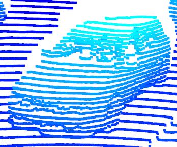

# Writeup for midterm project (Task ID_S1_EX2)

Here are some examples of vehicles with varying degrees of visibility in the point-cloud: 

1. Vehicle behind the Waymo car -> well visible from the front\
  
2. Trailer whose loading platform is partly occluded by its rear end\
   
3. Car right next to the Waymo car -> partly within the blind spot of the top Lidar\
   
4. Car in front of and far away the Waymo car -> rear bumper detected at low resolution\
   
5. Vehicles seen from the side and partly occluding each other\
   
6. Cars in front of the Waymo car -> rear bumper visible\
   

For most vehicles, the front or rear bumpers are relatively stable features that appear as
roughly parallel curved lines. Around the head/tail lights these lines bend a bit differently to follow
the shape of the lights. On the other hand, e.g. the windows do not appear in the Lidar detections
as they are transparent to the wavelengths of light that the Lidar is using.

Looking at an excerpt from the range image (range channel on top, intensity channel on the bottom), we
can also see that the abovementioned features reflect the Lidar beam very well (with high intensity):
